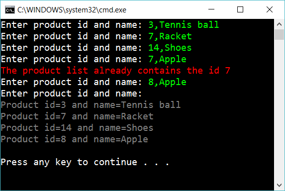

# 2 Product list with dictionary

Create the following console app:

Let the user input products. A product is supposed to be entered as a number and a description separated with comma. When the user just press enter, then display all the products.

If the user enter a product’id that is already taken, then respond with an error message.

## Extra

1. Add one more property for Product and use it in the program

2. A product can be sold in zero, one or many Stores. Add necessary code for this (so the user can input a product together with stores)

## Hint

Create two methods, one for getting the input and one for the response:

    Dictionary<int, string> products = BuildProductDictionary();
    DisplayProductDictionary(products);

Check if a value is in the dictionary:

    mydictionary.ContainsKey(...)

