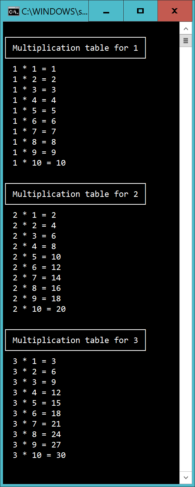

# Multiplication table

Create a method that can be called like this:

    MultiplicationTable(3);

...which should give the multiplication table until (in this case) three:

## Extra

1) Create a method:

    MultiplicationTable(2, 4);

... that should give:

    Multiplication table for 1

    1 * 1 = 1
    1 * 2 = 2
    1 * 3 = 2
    1 * 4 = 2

    Multiplication table for 2

    2 * 1 = 2
    2 * 2 = 2
    2 * 3 = 2
    2 * 4 = 2

## Hint

To draw the box use unicodes:

http://xahlee.info/comp/unicode_index.html

...and write this to enable unicode characters:

    Console.InputEncoding = System.Text.Encoding.Unicode;
    Console.OutputEncoding = System.Text.Encoding.Unicode;
