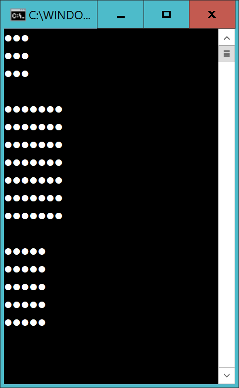
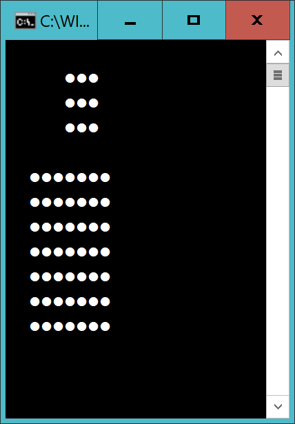

# Square

Gör en metod *DrawSquare* som om det anropas såhär: 

    DrawSquare(3);
    DrawSquare(7);
    DrawSquare(5);

...ska ge följande:

## Extra

Utöka metoden *DrawSquare* så andra parametern anger hur mycket marginal till vänster som fyrkanten ska ha. 

Alltså detta:

    DrawSquare(3, 5);
    DrawSquare(7, 2);

...ska ge

