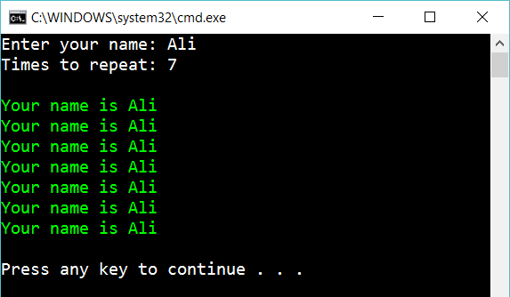

# 2 While

Create the following console app:

 
The program repeats the text as many times as the user tell.

Use a while-loop to solve this.

## Extra

1. Solve the exercise with two different while-loops.

Like this:

    while(true) 
    {
    }

...and like this:

    while(...) 
    {
    }

2. Is it good/bad to use “do...while(...)” in this exercise?

3. Handle user input: if number of times is to high/low or the name is to long/short

4. Let the user decide if the output should be written as above or comma-separated in one line:

	    Your name is Ali, Your name is Ali, Your name is Ali, Your name is Ali...

## Hint

Use

    while-loops