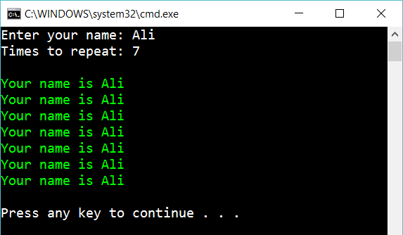

# 3 For

Use a for-loop to solve the previous exercise (the while-exercise)

Compare the solutions. 

## Extra

1. Ask for two numbers: column and row. Ask for a name. If the user enters 3 rows and 4 columns and the name Ali, this should be the output:

        Ali         Ali         Ali         Ali         
        Ali         Ali         Ali         Ali         
        Ali         Ali         Ali         Ali         

2. Same as above but write the name forward and back:

        AliilA        AliilA        AliilA        AliilA        
        AliilA        AliilA        AliilA        AliilA        
        AliilA        AliilA        AliilA        AliilA        

3. Same as “extra 1”. But let the user decide how many times he/she want to repeat the name on each “cell”. Here the user has chosen to repeat the text three times:

        AliAliAli         AliAliAli         AliAliAli         AliAliAli         
        AliAliAli         AliAliAli         AliAliAli         AliAliAli         
        AliAliAli         AliAliAli         AliAliAli         AliAliAli       

## Hint

Use

    for-loops

This will repeat something ten times:

    for(int x=0; x<10; x++) 
    {
        // Things to repeat
    }