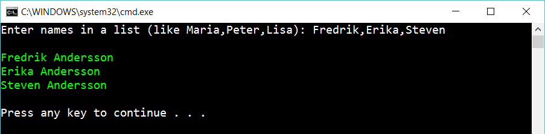

# 4 Foreach

Create the following console app:

 
The program print out the entered names and adds with “Andersson”. 

## Extra

1. Handle user input: if a name is to short/long or the list is empty

2. Let the user decide which surname to add

3. Let the user decide which order to display the names in the list

4. Output the list like this:

	    [1] Fredrik Andresson
	    [2] Erika Andersson
	    [3] Steven Andersson

5. After the list is show, let the user decide which person to remove, by entering a number. Then display the list again.

## Hint

Read about

    foreach

    mystring.Split(...)