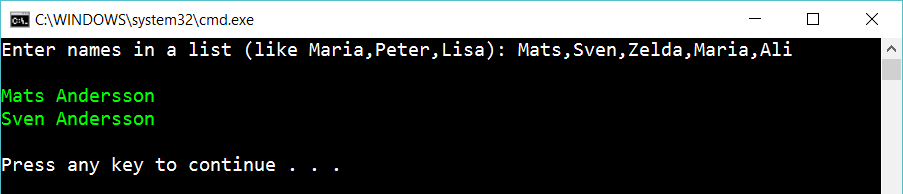

# 5 Foreach with break

Create the same program as before (the foreach-exercise). But if the list contains *Zelda*, then ignore the rest of the list:

Use foreach and break to solve the program.

## Extra

1. Let’s add a special command. If one of the names is *AllowZelda* then don’t stop for Zelda. 
 

...so the following input: 
   
    Mats, Sven, Zelda, Maria, AllowZelda, Ali

...should result in this list:

	Mats Andersson
	Sven Andersson
	Zelda Andersson
	Maria Andersson
	Ali Andersson

2. Figure out one more special command like *AllowZelda* that manipulate the result.

## Hint

Read about

    foreach loops

    "break" inside of a loop