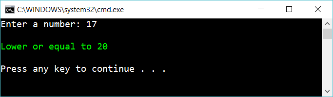

# 7 Conditional operator

Create the same app as previous exercise (the if-exercise)

 

But use the conditional operator **?:** to solve the problem. 

## Extra

1. Create one line of code that return a string depending on if the entered number is above, equal or below 20:

        "Lower than 20"
        "Equal to 20"
        "Higher than 20"

Use the conditional operator within itself (twice)

2.What do you think about this solution compared to using multiple if's? Is it easier or harder to read? Discuess with your colleagues.

## Hint

Read about

    conditional if's

Set the string "mystring" to different things depending on the variable "somethingThatIsTrueOfFalse"

    string mystring = (somethingThatIsTrueOfFalse) ? "aaaa" : "bbbb"