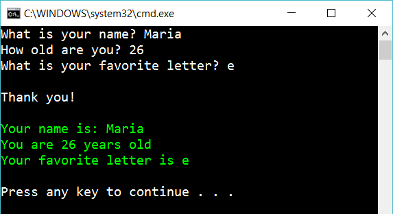

# 1 Respond to user input

Create the following console app:

The program should ask the user for his/her name, age, and favorite letter. Then respond to the user (the green part). Use strings all the way.

## Extra

1. Ask for two more values from user and respond. Use strings here as well

2. Write the answer in green (as shown above)

3. Write the answer like a rainbow. First letter in yellow, second letter it blue, third letter in red…. 

4. Is it good/bad to use strings as types for everything?

## Hint

Try

    string myVariable = Console.ReadLine();
    Console.WriteLine("Some text");