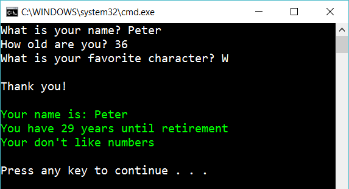

# 2 Working with different types

Create the following console app:

It should work similar to the previous program. But the program should respond how many days until retirement. And write “You like numbers” if the user enter a number as a favorite character.

## Extra

1. What happens if you enter a letter instead of a number for your age?

2. Debug the program, set a breakpoint after the user has entered the age. Change the value that the user entered and let the program continue.

3. Make a sound if the user enter a specific name and age

4. Adjust the program so it displays questions in different order each time the program is running.

## Hint

Try

    int.Parse(...)
    char.Parse(...)
    Console.ForegroundColor
    char.IsNumber(...)
