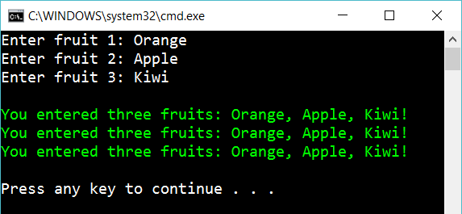

# 3 String creation

Create the following console app:

The user enters **three** fruits and the program respond as you see (in green).

Write the same message three times (as you see in the image) and use three different ways to build up a string:

- Concatenation
- Using placeholders
- Interpolation

## Extra

1. What do you think is the advantages/disadvantages of the different ways to build a string?

2. First ask how many fruits the user want to add. 

3. Investigate the class *StringBuilder*. Use StringBuilder to create the string

4. Remove all whitespaces before and after the string (“   Orange  “ => “Orange”). Respond with just lowercase (“orange, apple, kiwi”)

5. Tell the user how many of the fruits that contains the text “range” (for example “Orange”)

## Hint

Try

	"..." + "..." + "..."
    string.Format("...")
    var mystring = $"{myVariable1} some text {myVariable2}";