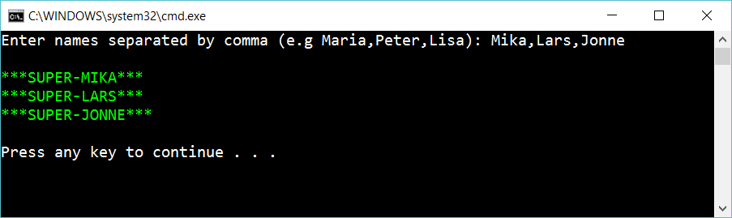

# 1 Creating methods

Create the following console app:

 

First solve this without using methods. Save this solution.

Look at your program. Try to divide the program into three (or more) methods.

## Extra

1. Compare the new solutions (with methods) to the old. Did you get a better or worse solution?

2. Investigate access modifiers:

	    private, public, protected

Which is appropriate in your program?

## Hint

Read about methods

When solving this problem, create three metods: 

    string GetInputFromUser()
    string[] CreateArrayOfPeople(string response)
    void RespondToUser (string[] peopleArray)

To get the size of an array:

    myArray.Length 

