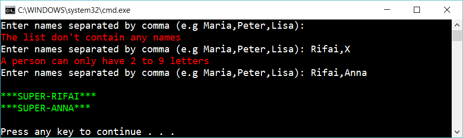

# 3 Validation

Continue on the app so it works with validation:

Validation rules:
- the list of people can't be empty
- The amount of characters in a name have to be between 2 and 9
 
## Extra

1. Just allow the letter a-z, å,ä,ö in the name. Update *PeopleArrayIsValid*.

2. Figure out two more way to validate the name. Update *PeopleArrayIsValid*.

3. Do the validation with *regular expressions*. Update *PeopleArrayIsValid*.

## Hint

Add a method

    bool PeopleArrayIsValid(string[] peopleArray)

…that returns true if peopleArray has at least one element and all names in the array is have a length of 2 to 9 letters.

