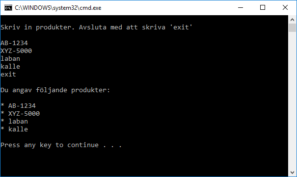
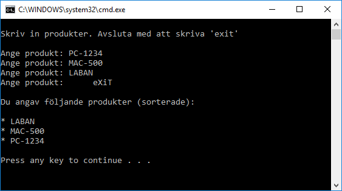
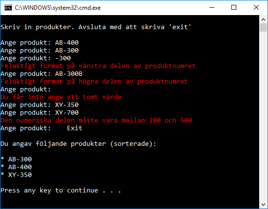

# Produktlista

## Intro

Du ska skriva en console-app som frågar efter ett antal produkter. Efter att användaren har skrivit *exit* så visas alla (korrekt) inmatade produkter.

Den första nivån av programmet är ganska lätt. Level 3 är mycket svår. Försök komma så lång du hinner.

## Level 1

I första nivån behöver du inte bry dig om formatet på den inmatade produkten.

Användare anger en produkt och trycker *return*. När användaren fått nog så skriver hon *exit*. Då ska alla produkter visas. 

Se följande exempel:

## Level 2

Fortsätt med programmet. Lägg till följande:
- Användaren ska kunna skriva *exit* på olika sätt. Stora eller små bokstäver ska inte spela någon roll. Inledande eller avslutande mellanslag ska också accepteras.
- När användaren är klar, visa en sorterad lista

Se följande exempel:

## Level 3

Nu ska du validera produktnamnet och bara acceptera ett namn som består av 

    bokstäver bindestreck siffror

Siffer-delen måste vara ett heltal mellan 200 och 500.

Exempel på giltiga produktnamn:
- CE-400
- XX-480
- LABAN-231

Exempel på ogiltiga produktnamn:
- CE400
- XX3-480
- LABAN-100

Ge olika felmeddelande beroende på vilket fel användaren gör.

Se följande exempel:

